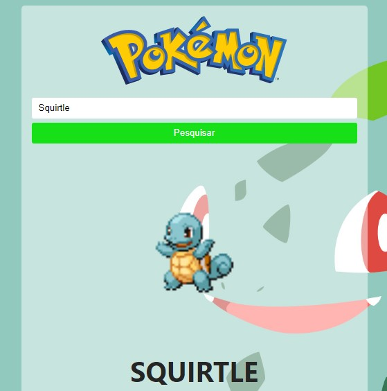

<h1 align="center">Pokedex</h1>

## Objetivo
Aplicação desenvolvida em React que realiza pesquisas de pokemons de todas as gerações utilizando a API do PokeAPI retornando uma imagem de exemplo, tipo, peso, altura e habilidades.

<!-- ## Exemplo do aplicativo
[Clique aqui!](https:// /) -->

<h1 align="center">
  
</h1>

## Tecnologias / Ferramentas / Bibliotecas
- HTML
- CSS
- JavaScript
- React

## Status
- [x] Finalizado (10/02/2021)

## Links
- [PokeAPI](https://pokeapi.co/)
